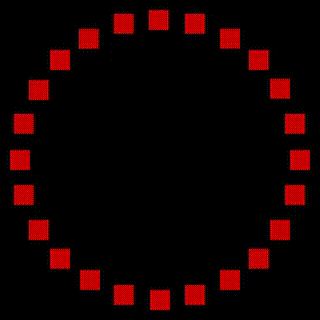
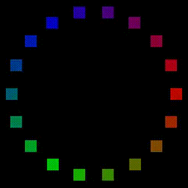
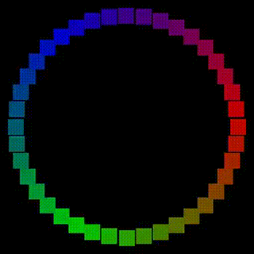

# Animation Gallery

These previews show complete power-up, idle, and shut-down sequences for every pack mode and LED configuration. Each GIF links to a corresponding MP4 recording.

## Movie / Snap Mode (GB1/GB2)
DIP1 – OFF, DIP2 – OFF, DIP3 – OFF

| Cyclotron LEDs | Powercell (15) | Cyclotron | Future/Vent (18) |
| --- | --- | --- | --- |
| 4  |  [MP4](SOFTWARE/animations/movie_powercell_sequence_15_blue.mp4) |  [MP4](SOFTWARE/animations/movie_cyclotron_sequence_4_red.mp4) |  [MP4](SOFTWARE/animations/movie_future_sequence_18_white.mp4) |
| 24 |  [MP4](SOFTWARE/animations/movie_powercell_sequence_15_blue.mp4) |  [MP4](SOFTWARE/animations/movie_cyclotron_sequence_24_red.mp4) |  [MP4](SOFTWARE/animations/movie_future_sequence_18_white.mp4) |
| 32 |  [MP4](SOFTWARE/animations/movie_powercell_sequence_15_blue.mp4) |  [MP4](SOFTWARE/animations/movie_cyclotron_sequence_32_red.mp4) |  [MP4](SOFTWARE/animations/movie_future_sequence_18_white.mp4) |
| 40 |  [MP4](SOFTWARE/animations/movie_powercell_sequence_15_blue.mp4) |  [MP4](SOFTWARE/animations/movie_cyclotron_sequence_40_red.mp4) |  [MP4](SOFTWARE/animations/movie_future_sequence_18_white.mp4) |

## Video Game / Fade Mode
DIP1 – ON, DIP2 – OFF, DIP3 – OFF

| Cyclotron LEDs | Powercell (15) | Cyclotron | Future/Vent (18) |
| --- | --- | --- | --- |
| 4  |  [MP4](SOFTWARE/animations/video_game_powercell_sequence_15_blue.mp4) |  [MP4](SOFTWARE/animations/video_game_cyclotron_sequence_4_red.mp4) |  [MP4](SOFTWARE/animations/video_game_future_sequence_18_white.mp4) |
| 24 |  [MP4](SOFTWARE/animations/video_game_powercell_sequence_15_blue.mp4) |  [MP4](SOFTWARE/animations/video_game_cyclotron_sequence_24_red.mp4) |  [MP4](SOFTWARE/animations/video_game_future_sequence_18_white.mp4) |
| 32 |  [MP4](SOFTWARE/animations/video_game_powercell_sequence_15_blue.mp4) |  [MP4](SOFTWARE/animations/video_game_cyclotron_sequence_32_red.mp4) |  [MP4](SOFTWARE/animations/video_game_future_sequence_18_white.mp4) |
| 40 |  [MP4](SOFTWARE/animations/video_game_powercell_sequence_15_blue.mp4) |  [MP4](SOFTWARE/animations/video_game_cyclotron_sequence_40_red.mp4) |  [MP4](SOFTWARE/animations/video_game_future_sequence_18_white.mp4) |

## TVG Mode
DIP1 – OFF, DIP2 – ON, DIP3 – OFF

| Cyclotron LEDs | Powercell (15) | Cyclotron | Future/Vent (18) |
| --- | --- | --- | --- |
| 4  |  [MP4](SOFTWARE/animations/tvg_powercell_sequence_15_blue.mp4) |  [MP4](SOFTWARE/animations/tvg_cyclotron_sequence_4_red.mp4) |  [MP4](SOFTWARE/animations/tvg_future_sequence_18_white.mp4) |
| 24 |  [MP4](SOFTWARE/animations/tvg_powercell_sequence_15_blue.mp4) |  [MP4](SOFTWARE/animations/tvg_cyclotron_sequence_24_red.mp4) |  [MP4](SOFTWARE/animations/tvg_future_sequence_18_white.mp4) |
| 32 |  [MP4](SOFTWARE/animations/tvg_powercell_sequence_15_blue.mp4) |  [MP4](SOFTWARE/animations/tvg_cyclotron_sequence_32_red.mp4) |  [MP4](SOFTWARE/animations/tvg_future_sequence_18_white.mp4) |
| 40 |  [MP4](SOFTWARE/animations/tvg_powercell_sequence_15_blue.mp4) |  [MP4](SOFTWARE/animations/tvg_cyclotron_sequence_40_red.mp4) |  [MP4](SOFTWARE/animations/tvg_future_sequence_18_white.mp4) |

## Afterlife Mode
DIP1 – ON, DIP2 – ON, DIP3 – OFF

| Cyclotron LEDs | Powercell (15) | Cyclotron | Future/Vent (18) |
| --- | --- | --- | --- |
| 4  |  [MP4](SOFTWARE/animations/afterlife_powercell_sequence_15_blue.mp4) |  [MP4](SOFTWARE/animations/afterlife_cyclotron_sequence_4_red.mp4) |  [MP4](SOFTWARE/animations/afterlife_future_sequence_18_white.mp4) |
| 24 |  [MP4](SOFTWARE/animations/afterlife_powercell_sequence_15_blue.mp4) |  [MP4](SOFTWARE/animations/afterlife_cyclotron_sequence_24_red.mp4) |  [MP4](SOFTWARE/animations/afterlife_future_sequence_18_white.mp4) |
| 32 |  [MP4](SOFTWARE/animations/afterlife_powercell_sequence_15_blue.mp4) |  [MP4](SOFTWARE/animations/afterlife_cyclotron_sequence_32_red.mp4) |  [MP4](SOFTWARE/animations/afterlife_future_sequence_18_white.mp4) |
| 40 |  [MP4](SOFTWARE/animations/afterlife_powercell_sequence_15_blue.mp4) |  [MP4](SOFTWARE/animations/afterlife_cyclotron_sequence_40_red.mp4) |  [MP4](SOFTWARE/animations/afterlife_future_sequence_18_white.mp4) |

## Party Mode
Activate by starting a song with the song switch, then tapping the fire button while the pack is off. All LEDs participate in the selected party pattern.

| Pattern | Powercell 15 | Future 18 | Cyclotron 4 | Cyclotron 24 | Cyclotron 32 | Cyclotron 40 |
| --- | --- | --- | --- | --- | --- | --- |
| Rainbow Fade |  [MP4](SOFTWARE/animations/party_rainbow_fade_15_rainbow.mp4) |  [MP4](SOFTWARE/animations/party_rainbow_fade_18_rainbow.mp4) |  [MP4](SOFTWARE/animations/party_rainbow_fade_4_rainbow.mp4) |  [MP4](SOFTWARE/animations/party_rainbow_fade_24_rainbow.mp4) |  [MP4](SOFTWARE/animations/party_rainbow_fade_32_rainbow.mp4) |  [MP4](SOFTWARE/animations/party_rainbow_fade_40_rainbow.mp4) |
| Cylon Scanner |  [MP4](SOFTWARE/animations/party_cylon_scanner_15_rainbow.mp4) |  [MP4](SOFTWARE/animations/party_cylon_scanner_18_rainbow.mp4) |  [MP4](SOFTWARE/animations/party_cylon_scanner_4_rainbow.mp4) |  [MP4](SOFTWARE/animations/party_cylon_scanner_24_rainbow.mp4) |  [MP4](SOFTWARE/animations/party_cylon_scanner_32_rainbow.mp4) |  [MP4](SOFTWARE/animations/party_cylon_scanner_40_rainbow.mp4) |
| Random Sparkle |  [MP4](SOFTWARE/animations/party_random_sparkle_15_rainbow.mp4) |  [MP4](SOFTWARE/animations/party_random_sparkle_18_rainbow.mp4) |  [MP4](SOFTWARE/animations/party_random_sparkle_4_rainbow.mp4) |  [MP4](SOFTWARE/animations/party_random_sparkle_24_rainbow.mp4) |  [MP4](SOFTWARE/animations/party_random_sparkle_32_rainbow.mp4) |  [MP4](SOFTWARE/animations/party_random_sparkle_40_rainbow.mp4) |
| Beat Meter |  [MP4](SOFTWARE/animations/party_beat_meter_15_rainbow.mp4) |  [MP4](SOFTWARE/animations/party_beat_meter_18_rainbow.mp4) |  [MP4](SOFTWARE/animations/party_beat_meter_4_rainbow.mp4) |  [MP4](SOFTWARE/animations/party_beat_meter_24_rainbow.mp4) |  [MP4](SOFTWARE/animations/party_beat_meter_32_rainbow.mp4) |  [MP4](SOFTWARE/animations/party_beat_meter_40_rainbow.mp4) |

To regenerate the previews locally:

```
cmake -S SOFTWARE/sim -B SOFTWARE/sim/build
cmake --build SOFTWARE/sim/build --target sim_led
jq -c '.[]' SOFTWARE/sim/animation_configs.json | while read cfg; do
  name=$(echo "$cfg" | jq -r '.name')
  leds=$(echo "$cfg" | jq -r '.led')
  color=$(echo "$cfg" | jq -r '.color')
  layout=$(echo "$cfg" | jq -r '.layout')
  ANIMATION_NAME="$name" LED_COUNT="$leds" COLOR="$color" LAYOUT="$layout" SOFTWARE/sim/build/sim_led </dev/null
  ffmpeg -y -framerate 60 -i frames/frame_%05d.ppm \
    -c:v libx264 -pix_fmt yuv420p SOFTWARE/animations/${name}_${leds}_${color}.mp4
  ffmpeg -y -i SOFTWARE/animations/${name}_${leds}_${color}.mp4 \
    -vf "fps=30,scale=320:-1:flags=lanczos" \
    SOFTWARE/animations/${name}_${leds}_${color}.gif
  rm frames/frame_*.ppm
done
```
