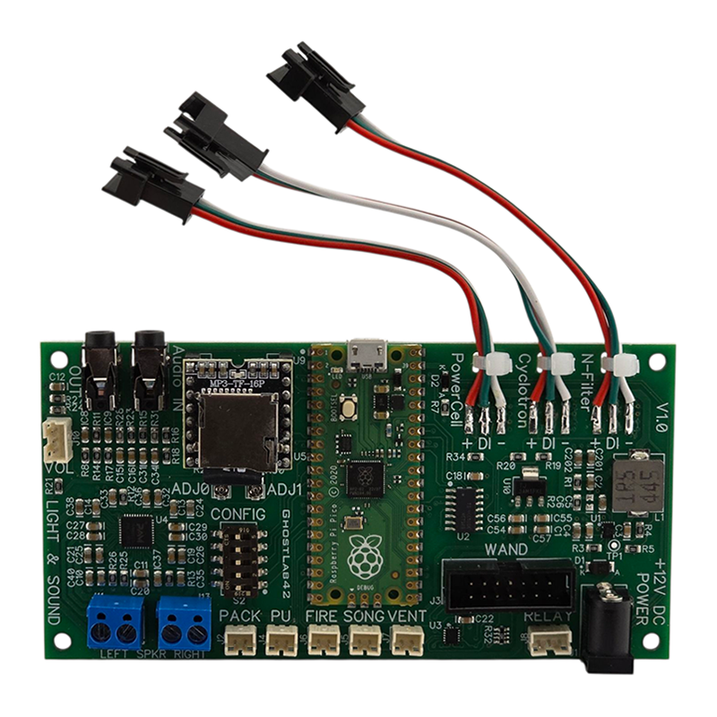

# Pack Light & Sound Main Board

## Overview
The pack light and sound kit main board combines a Raspberry Pi Pico with a 2×10 W class‑D stereo amplifier and screw‑terminal
power distribution. It accepts 9–14 V battery input, mixes an auxiliary 3.5 mm stereo line‑in with on‑board sounds and drives all
lighting, user inputs and audio outputs from a single board.

## Power and Audio Connections
- **Battery in/out** – two sets of screw terminals distribute the main 9–14 V battery to other light kits. One pair is always
  live (“Constant”) and one is switched under firmware control (“Switched”).
- **Speakers** – left and right 8 Ω speakers connect to `L‑SPK` and `R‑SPK` terminals (`SP+`/`SP‑`).
- **Stereo line‑in** – a 3.5 mm jack mixes external audio (e.g. an MP3 player) with pack sounds.
- **Volume control** – an on‑board 50 kΩ audio‑taper potentiometer adjusts overall level. The pot may be removed and wired to the
  3‑pin JST‑PH header for a remote control.

## LED Outputs
- **Powercell** – 15 WS2812 pixels on GPIO 3.
- **Cyclotron** – up to 40 WS2812 pixels on GPIO 4. The firmware can mask the ring to 4, 24, 32 or 40 LEDs.
- **Future (N‑Filter)** – 16 WS2812 pixels on GPIO 5.

## Configuration Controls
### DIP switches
A 5‑position DIP switch block configures pack behaviour:
1. **PackSel0** – first bit of the pack selection.
2. **PackSel1** – second bit of the pack selection.
3. **Heat** – enables heating effects.
4. **Interactive** – enables the monster Easter‑egg.
5. **Hum** – plays a continuous idle hum track.

### Potentiometers
Two adjustment potentiometers feed ADC channels on the Pico:
- **ADJ0** – sets animation speed.
- **ADJ1** – selects the logical cyclotron LED count (4, 24, 32 or 40).

## User Switch Inputs
Five debounced inputs provide user controls:
- **Pack power request** (`pack_pu_sw`)
- **Main power switch** (`pu_sw`)
- **Fire** (`fire_sw`)
- **Song** (`song_sw`)
- **Vent** (`vent_sw`)

Each switch header exposes both pull‑up (`PU`) and pull‑down (`PD`) inputs so either normally‑open or normally‑closed switches,
or existing light‑kit signals, can be connected without extra hardware.

## Other Outputs
- **NBUSY to wand lights** – GPIO 12 indicates autovent status.
- **Vent light** – GPIO 28 drives the vent lamp.
- **Audio mute** – GPIO 22 mutes the external sound board.

## Firmware
Firmware source lives in the [`SOFTWARE`](../SOFTWARE) directory. See the repository root [`README.md`](../README.md) for build and flashing instructions.

## Introduction
Congratulations on purchasing the Proton Pack: Amplified Sound Board, the only
Proton Pack sound package you will ever need! It combines lighting control, a
serial sound module and a 2×10 W class‑D amplifier so a single battery can power
your entire pack.

### Pack Sound Board features
- 2×10 W stereo audio amplifier
- Works with battery voltages from 9 V to 14 V
- Multiple battery screw terminals distribute power to other light kits
- Stereo line‑in to connect your own MP3 player
- Works with separate switches or ones already used in other light kits—no new
  switches required
- Combined signal and power connectors for future pack and wand light kits to
  simplify wiring

The board includes configuration switches to select between four main modes of
operation:

1. **Movie pack sounds**
2. **Movie pack sounds with interactive features**
3. **TVG pack sounds** – cycle through eight TVG weapons
4. **TVG proton pack only sounds** timed to match R2DEVO

Interactive examples include quotes triggered when firing shortly after hearing
a Slimer sound (“Now that wasn't such a chore” or “Whoa, nice shootin' Tex”).
TVG pack sounds include the Proton Stream, Boson Dart, Slime Blower, Slime
Tether, Stasis Stream, Shock Blast, Overload Pulse and Meson Collider. The
appropriate hum (Proton, Slime, Stasis or Overload) is enabled by the **Hum**
switch. TVG modes track the pack’s temperature, beeping and auto‑venting when
overheating; you can also manually vent to cool the pack sooner. Mode 4 heating
is tuned to match R2DEVO lights and allows up to 12 s of firing before
overheating.

## Switch Inputs
Only four user switches are needed to control the sounds:

1. **PowerUp** – plays power‑up and power‑down sounds
2. **Fire** –
   - Hold for continuous firing (Proton Stream)
   - Hold and release for single shots (Boson Dart in TVG modes)
   - Tap quickly to cycle TVG weapons
3. **Song** – toggling this input starts the Ghostbusters theme song. It works
   even after a power‑down sound, as long as battery power remains.
4. **Vent** – plays the vent sound. In TVG pack sounds, a “dry vent” is heard if
   the pack is already cool.

Each switch header provides both pull‑up (**PU**) and pull‑down (**PD**)
connections so normally‑open or normally‑closed switches can be used without
additional hardware.

## Configuration DIP Switch Settings
A five‑position configuration DIP switch resides at the top of the board. The
switches select pack behavior and optional features:

| Switch | Function |
| ------ | -------- |
| 1 | PackSel0 – pack selection bit 0 |
| 2 | PackSel1 – pack selection bit 1 |
| 3 | Heat – enables heating effects and Afterlife TVG when switches 1 and 2 are both on |
| 4 | Interactive – enables monster/interactive Easter‑egg sounds |
| 5 | Hum – plays a continuous idle hum track |

### Pack configuration selections

| PackSel1 | PackSel0 | Pack configuration |
| -------- | -------- | ----------------- |
| 0 | 0 | Movie pack sounds (snap) |
| 0 | 1 | Movie pack sounds (fade) |
| 1 | 0 | TVG pack sounds; tap Fire to cycle eight weapons |
| 1 | 1 | Afterlife pack. With **Heat** on, enters Afterlife TVG mode |

### Hum selection

Switch 5 **ON** enables the idle hum. Switch 5 **OFF** mutes the hum when the
pack is idling.

## Installation

### 1. Battery connections
Use a single 9–14 V battery to power the board and any connected pack or wand
light kits. Two “Constant” screw terminals distribute unswitched battery power
while another pair labeled “Switched” is controlled by the firmware. Share a
common ground between all boards. Some wand light kits already provide switched
power; their output may be connected directly to the sound board’s input. Never
connect the battery directly to the “Switched” terminals.

### 2. Test the battery power connection
Apply battery power and verify the red **Power** LED illuminates. Confirm that
the pack’s main power switch controls the sound board and any light kits before
proceeding.

### 3. Connect a pair of speakers
With power off, attach 8 Ω speakers to the `L‑SPK` and `R‑SPK` screw terminals
(`SP+`/`SP‑`). Match polarity on both speakers. Set all DIP switches to **OFF**
to prevent sounds during testing.

### 4. Test the speakers
Set the volume control to its mid detent. To test with an MP3 player, connect a
3.5 mm stereo cable from the player’s headphone jack to the board’s input and
start playback. Turn on the board and adjust volume on both the player and the
board. Without an MP3 player, power the board and briefly short the **Song**
input (`PU` to `Gnd`) to play the theme song. Adjust volume from silent to loud
to confirm operation.

### 5. Connect up to four sound activation switches
The board accepts either separate switches or signals shared with light kits.
For separate switches, connect one wire to `PU` and the other to `PD` (order is
not important). For shared switches, run the live side of the switch to the
appropriate `PU` or `PD` terminal. If a switch behaves backwards, move the wire
to the other terminal. Configure and test one switch at a time.

### 6. Volume control
An on‑board 50 kΩ audio‑taper potentiometer adjusts overall volume. For remote
control, desolder the pot and wire an external 30–60 kΩ audio‑taper pot to the
3‑pin JST‑PH header (`Red` = ground, `Yellow` = wiper, `Black` = +3 V). Long
wires do not affect sound quality.

### 7. MP3 player connection
The black 3.5 mm stereo jack at the bottom of the board mixes external audio
with pack sounds. MP3 player volume controls the relative level.

## FAQ

### What speakers will work with this board?
A full‑range 8 Ω speaker rated for at least 10 W is recommended. Two 4 Ω
speakers may be wired in series to present an 8 Ω load. Higher‑power car audio
speakers also work well, and efficiency greatly affects output volume.

### Do I have to use both speaker connections?
The board drives stereo speakers. If only one speaker is used, connect it to
either channel. To ensure identical audio on both channels, convert stereo sound
files on the µSD card to mono (e.g. with Audacity) and copy them back.

### Wire gauge
For a total load of about 2.5 A over a 6 ft run, #22 wire keeps voltage drop
below 2 %. #18 stranded wire is overkill but works well. Control and potentiometer
wires carry little current so almost any gauge (28–20) is fine.

### Distortion board
An external distortion‑fix module is not needed; the sound module and amplifier
are designed to work together from a single battery.
